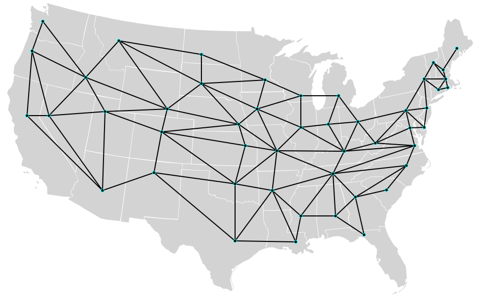

# SQLServerGraph_USCapitals
SQL Server scripts to create a bi-directional graph database of the US Capitals and the distances between them.

US Capitals is a popular dataset for working with graphs. Nodes identify a state capital. The edges in this graph connect a capital in one state with the capitals of all neighboring states.  Only the lower 48 states are present. This is a graphical representation of the graph from [Randal Bryant at Carnegie Mellon University](https://www.cs.cmu.edu/~bryant/boolean/maps.html)

While the data is readily available, I was unable to find TSQL scripts to create the graph using SQL Server 2017 graph database.  Using data from [Neil Wagner at The University of Texas at San Antonio](http://www.cs.utsa.edu/~wagner/CS3343/graphapp/graphapp.html), I created those scripts.

Create a SQL Server database and execute these scripts in order:

### 1_CreateGraphNode_Capitals.sql

### 2_CreateGraphEdge_Distances.sql

### 3_InsertNode_Capitals.sql

### 4_InsertEdge_Distances.sql

*There are two sets of INSERT statements in order to create a bi-directional graph.  Without both edges, the graph could only be traversed in one direction.*
